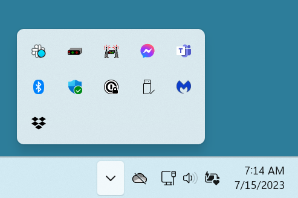
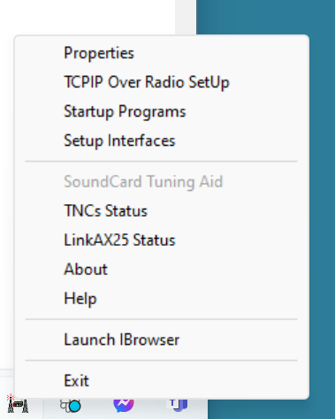
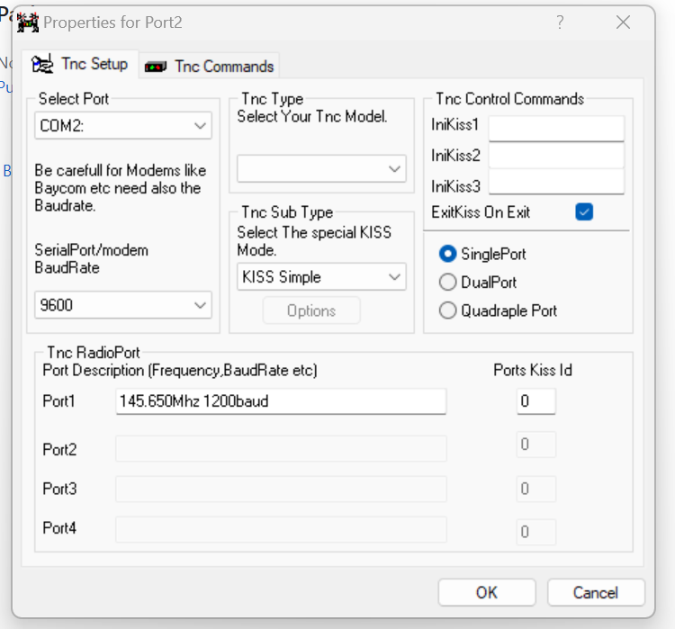
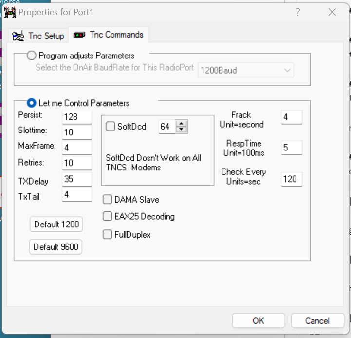
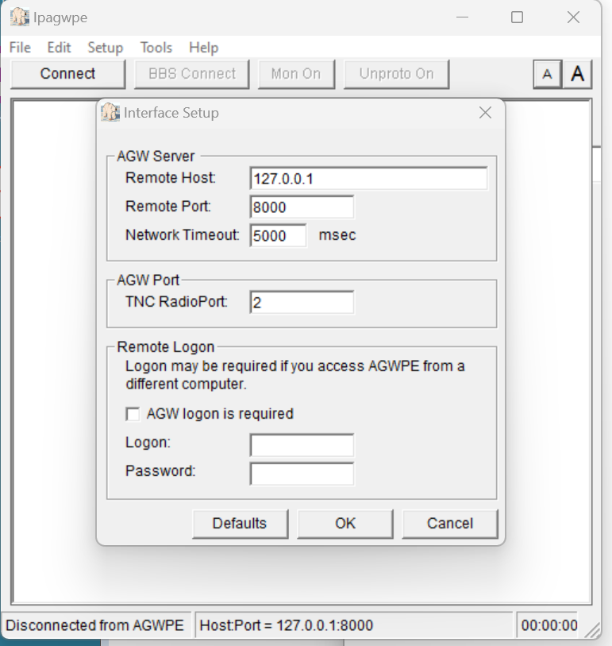

# Mobilelinkd TNC 4
http://www.mobilinkd.com/

It is an interesting device in that it offers both bluetooth connectivity. Althought if connecting to a PC or Mac, use the serial port via the USB C port.  Bluetooth shows up as 2 serial ports.  One incoming and one outgoing.

## Window 11/AGWPE/Outpost Ipagwpe
### Packages to Download

#### agwpe

#### Outpost
https://www.outpostpm.org/index.php

#### agwpe
https://www.sv2agw.com/downloads/

Unzip and place in c:\agwpe

### AGWPR setup
To start agwpe run c:\agwpe\AWS Packet Engine.exe.  The banner for agwpe might open and show for a few seconds. Then to access the program expand the apps in the lower right of the taskbar. You will see agwpe and other apps.

Agwpe is toprow, 2nd gtom the left.  The 2 antnenna towers with the modem in te midde. Right click it and you will see the menu.

The first thing you want to do is setup the connection to your modem. You can see I have already set mine up. Click "New Port" to setup  new modem.  Select and click OK to edit one. These are saved in a file port0.ini and the baackup in port0.old.

#### TNC Setup values
For the serial port, look at the device manager to figure out what what comport to use.
![properties(images/agwpe_properties.png)

Duplicate these settings

Duplicate these settings and click on "Default 1200}

Click OK to save the settings.

