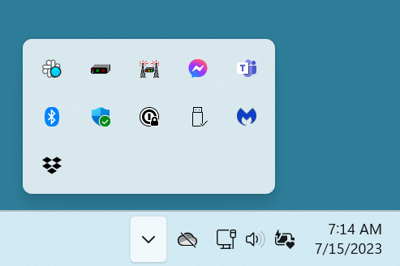

# Mobilinkd  TNC 4
http://www.Mobilinkd .com/

This is an interesting device in that it offers both bluetooth and USB serial connectivity. Although if connecting to a PC or Mac, use the serial port via the USB C port.  Bluetooth shows up as 2 serial ports.  One incoming and one outgoing.

## Window 11/AGWPE/Outpost Ipagwpe
This is just an organized brain dump.  Feel free to sumbit a PR or email notes. Happy to update.

As I get additional configurations working I'll add to this page.  I want to try direwolf from windows and raspberry pi.  Different radios, kenwood TH d-7a, yeasu vx-5. Sound card like the dinah.

### Connections
Use a cable to connect the USB C port on the mofem to your PC.
Use the correct interface cable to connect to the radio. I am using a FT-8800.  So the 3.5mm TRRS audio connector/mini din 6 cable is what I am using for 1200 baud communication. The minidin M/F cable was not needed for me.
### Packages to Download

#### Outpost
https://www.outpostpm.org/index.php

#### agwpe
https://www.sv2agw.com/downloads/

Unzip and place in c:\agwpe

### AGWPE Setup
To start agwpe run c:\agwpe\AWS Packet Engine.exe.  The banner for agwpe might open and show for a few seconds. Then to access the program expand the apps in the lower right of the taskbar. You will see agwpe and other apps.

Agwpe is top row, 3nd to the left.  The 2 antnenna towers with the modem in te middle. Right click it and you will see the menu. Once you setup and connect to the tnc, the icon 2nd to the left, modem icon, in the top row will show up.

If you right click on the agwpe icon this is the menu.

#### TNC Setup Values
For the serial port, look at the device manager to figure out what what com port to use.

You see the bluetooth serial ports, com6 and com7, serapate com port for incoming and outgoing.  We will use the USB serial port, com8.

The first thing you want to do is setup the connection to your modem. You can see I have already set mine up. Click "New Port" to setup  new modem.  Select and click OK to edit one. These are saved in a file port0.ini and the backup in port0.old.

Duplicate these settings and click on "Default 1200}

Click OK to save the settings.

### outpost
When you install outpost it will add a series of icons to your desktop. Double click the "Ipagwpe" icon. Since we are using AGWPE, we use the TCP/IP connection on port 8000 to commmunicate with the modem via agwpe.

Select "Setup->Interface" to setup the TNC connnection. The only change you need to make is to set the "TNC RadioPort" as identified in the agwpe properties dialog.

Next you will select "setup->connection" to add set your callsign and the callsign of the station you want to connect to. I do not know of W1AW has a node. Click OK then you should be good to go.

Now click "connect", the the "BBS Connect" should become active.

### Troubleshooting
If  double check the settings. 
+ Make sure you see both the agwpe icon and the modem icon.
+ Make sure your radio is on set to the correct frequency. And set to the corrct speed.
+ If using the mini din 6, is it seated correctly? Do you need the  M/F cable ?
  Check the page for an explanation of this cable https://store..com/collections/tnc-cables/products/minidin-6-1200-baud-adapter
+ Ipagwpe port and agwpe port match?
+ Baud rate for mode 115000?

